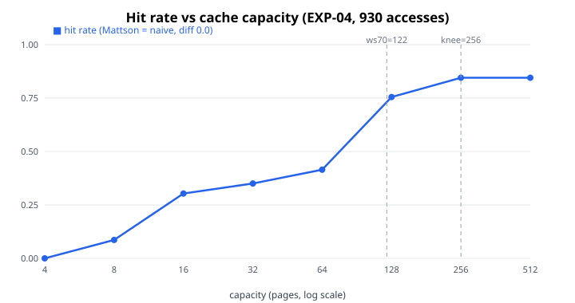
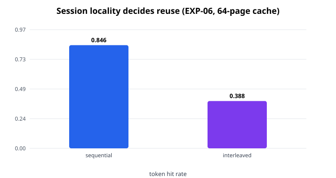
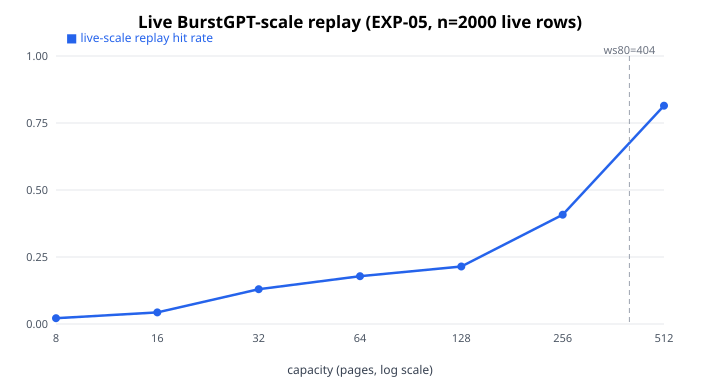

# KV Prefix-Cache Working-Set Study

> **One line:** A from-scratch, fully reproducible study that proves how LLM servers skip repeated prompt work with KV prefix caching — and measures exactly how much cache your workload needs.

[](LICENSE)
[](requirements.txt)
[](Dockerfile)
[](experiments/run_all.py)
[](results/)
[](https://m0-ar.github.io/kv-prefix-cache-working-set-study/preview.html)

**[🌐 Open the interactive site](https://m0-ar.github.io/kv-prefix-cache-working-set-study/preview.html)** · **[📖 Beginner guide](#-beginner-guide--read-this-and-you-are-a-professional)** · **[🧪 Quiz yourself](#-test-yourself--interactive-quiz)** · **[🎬 Demo](#-demo--watch-it-run)** · **[📊 Results](#6-results-all-values-are-executed-outputs-in-results)**

> **Site URLs (rendered pages, open in browser):**
> home — <https://m0-ar.github.io/kv-prefix-cache-working-set-study/> ·
> interactive — <https://m0-ar.github.io/kv-prefix-cache-working-set-study/preview.html> ·
> mirror — <https://m0-ar.github.io/kv-prefix-cache-working-set-study/docs/preview.html>
> (which one resolves depends on the Pages source setting — see [Interactive site + GitHub Pages](#-interactive-site--github-pages). Locally, just double-click `preview.html`.)

---

## CEO summary (30 seconds)

**AI agents resend their whole conversation on every turn; naive servers redo all prompt computation every time, and at 70B scale that state costs 320 KiB per token (10 GiB per 32K context).** This repo proves — with runnable code, not slides — that caching attention keys/values and reusing exact token prefixes removes the repeated work, then measures the real trade: **122 cache pages buy 70% reuse and 136 buy 80% on our trace, while 90% is unreachable at any tested capacity, and simply keeping same-session turns together beats interleaving 0.846 to 0.388.** Everything reproduces in one command (`docker compose up --build`), grounds itself in live public BurstGPT data, and is written so anyone can follow it from zero to professional.

---

## What you get here

| Artifact | Location | What it is |
|---|---|---|
| 🔬 Experiments 01–06 | `experiments/` | Six asserted checks; every paper number comes from these |
| 🧱 Library | `src/` | Toy causal attention, LRU prefix cache, Mattson analyzer, memory model, trace loader |
| 📦 Measured results | `results/` | JSON + CSV regenerated on every run (never hand-edited) |
| 🌐 Interactive site | `preview.html` (+ `docs/preview.html` + `docs/index.html` mirrors; `index.html` entry) | Animated demos, charts, step-by-step walkthrough, quiz |
| 📊 Figures | `assets/*.svg` | Generated from measured results by `assets/generate_figures.py` |
| 🎬 Demo | `scripts/demo.sh`, `docs/DEMO.md`, `docs/demo.tape` | 60-second terminal demo + GIF/MP4 recording guide |
| 🐳 Reproducible runner | `Dockerfile`, `docker-compose.yml`, `Makefile` | Bit-identical reruns anywhere |
| ✅ Regression tests | `tests/` | Fast offline suite (5 tests) |

## Quick start (3 steps, ~2 minutes)

```bash
# 1. Get it (Docker path needs nothing else installed)
git clone <your-fork-url> && cd kv-prefix-cache-working-set-study

# 2. Run all six experiments
docker compose up --build
# without Docker:  pip install -r requirements.txt && python experiments/run_all.py

# 3. Check you see this last line:
# ALL EXPERIMENTS PASSED
```

Then open the hosted site above — or locally double-click `preview.html` — for the visual tour.

## Table of contents

- [CEO summary](#ceo-summary-30-seconds)
- [Beginner guide](#-beginner-guide--read-this-and-you-are-a-professional)
- [Features](#-features)
- [User stories](#-user-stories--who-this-repo-is-for)
- [Demo](#-demo--watch-it-run)
- [Interactive site + GitHub Pages](#-interactive-site--github-pages)
- [Results gallery](#-results-gallery)
- [Test yourself (quiz)](#-test-yourself--interactive-quiz)
- [The full paper](#prefix-caching-is-a-memorycompute-trade-not-a-free-lunch-verifying-kv-reuse-lru-working-sets-and-the-capacityhit-rate-knee-from-first-principles-to-live-traces)
- [FAQ](#-faq)
- [Glossary](#-glossary)
- [Troubleshooting](#-troubleshooting)
- [Roadmap](#-roadmap)
- [Contributing](#-contributing)
- [License](#-license)

---

## 🌱 Beginner guide — read this and you are a professional

*You will know more than most interview candidates. No prior knowledge assumed. Let's work this out in a step-by-step way to be sure we have the right answer.*

### Step 0 — The situation (30 seconds)

You chat with an AI agent. It reads a document, calls a tool, answers, calls another tool, answers again. Each time, your app sends **the whole conversation so far** back to the model — instructions, history, tool outputs, everything. The server must process all of it before writing the next word. That processing step is called **prefill**.

### Step 1 — Why prefill hurts (1 minute)

Think of prefill like re-reading an entire book every time someone asks you one more question about it. The longer the book, the slower the first word of your answer. Engineers measure **TTFT** (time to first token): how long until the answer *starts*. Long conversations → long prefill → slow TTFT → unhappy users and big GPU bills.

### Step 2 — The trick: remember your homework (2 minutes)

Inside the model, every word is converted into two small lists of numbers: a **key** (what this word offers) and a **value** (what this word means). A new word asks a **query**: "which past words matter for me?" It scores its query against all past **keys**, then blends the matching **values**. Keys and values together are the **KV cache**.

Here is the key insight, and it is worth saying slowly: **in a normal (causal) model, words can only look backward, never forward.** So when word 101 arrives, words 1–100 haven't changed. Their keys and values are still correct. The server keeps them and only computes word 101. That is the whole trick — Experiment 01 proves the cached answer equals the recomputed answer to within 0.00000000000001.

### Step 3 — From one chat to many chats (2 minutes)

Now the agent sends turn 2, which *starts with* turn 1's exact words plus new tool output. The server kept turn 1's keys and values, recognizes the matching beginning (**prefix**), and skips reprocessing it. It only processes the new tail. Experiment 02 shows the catch: the match is on **exact words-as-numbers (tokens)**, not meaning. Rephrase the same idea with different words and the cache mostly misses (3/3 blocks hit for the exact repeat, only 1/3 for the paraphrase). Similar ≠ reusable.

### Step 4 — The catch: memory (2 minutes)

Every remembered word costs real memory on **every layer** of the model. Our measurements (Experiment 03): an 8B-class model costs 128 KiB per word, a 70B-class model **320 KiB per word — 10 GiB for a 32K-word conversation**. A hundred such chats approach a terabyte. GPU memory is finite, so old entries get **evicted** (thrown out, least-recently-used first) and must be recomputed next time. Small cache in our demo: **0% reuse**. Bigger cache: **67% reuse**. Memory now vs. computation later — that is the trade.

### Step 5 — The professional question (3 minutes)

So: **how much cache buys the hit rate we need?** Plot reuse (hit rate) against cache size and you get a curve that rises fast, then flattens — the **knee**. Past the knee, more memory buys almost nothing. The smallest size that reaches your target is the **working set**. There is a beautiful 1970 algorithm (Mattson stack distances) that gets the *entire curve in a single pass* instead of re-simulating every size — Experiment 04 verifies it matches brute force to **exactly 0.0** difference, and finds: **122 pages for 70%, 136 for 80%, and 90% unreachable** on that workload. Targets matter: "the" working set doesn't exist until you name your target.

### Step 6 — Reality check (2 minutes)

We fetched **2,000 real public workload rows (BurstGPT)** live during the experiment: average request 552 tokens, median 334, the worst 1% over 2,000. Heavy-tailed reality, not tidy Poisson math. Scaled to that reality, the working set is **404 pages at 80%** (Experiment 05). Then the hidden patterns (Experiment 06): serve one conversation at a time and reuse is **0.846**; interleave twelve conversations and it collapses to **0.388** — scheduling beats raw memory. And a warning that will save your career: comparing block sizes by *block count* instead of *token budget* makes coarse blocks look 16× better than they are. Always normalize by tokens.

### Step 7 — You are now dangerous (in a good way)

You can now answer, from first principles with numbers: why agents are expensive, what prefix caching reuses and what breaks it, what a token costs in bytes, what a working set is and how to size it, and which measurement traps to avoid. The quiz below and the interactive site will lock it in. Welcome — you genuinely do know more than most interview candidates on this topic.

---

## ✨ Features

| Feature | Description | Where |
|---|---|---|
| 🔬 6 asserted experiments | Every claim executable; failures fail loudly | `experiments/`, `results/` |
| 🧮 Toy attention core | Full vs. cached decoding proven equal (1.15e-14) | `src/attention_kv.py` |
| 🗂️ vLLM-faithful LRU prefix cache | Complete-block prefix hits, LRU eviction, token+block rates | `src/prefix_cache.py` |
| 📐 One-pass Mattson analyzer | Whole capacity curve in one pass; exact vs. naive | `src/stack_distance.py` |
| 🧾 Byte-level memory model | Per-model bytes/token, GiB/context, 1/(1−r) leverage | `src/memory_model.py` |
| 🌍 Live-data replay | BurstGPT fetched at runtime; source recorded in output | `src/trace_loader.py` |
| 📊 Generated figures | SVGs built from measured results, never hand-drawn | `assets/` |
| 🌐 Interactive site | Animations, charts, walkthrough, graded quiz — offline-capable single file, mirrored so every Pages source setting resolves | `preview.html`, `docs/preview.html`, `docs/index.html`, `index.html` |
| 🎬 Demo pipeline | 60-s terminal demo + reproducible GIF/MP4 guide | `scripts/demo.sh`, `docs/DEMO.md` |
| 🐳 One-command reproduction | Docker + pinned deps + seeds; host == container | `Dockerfile`, `docker-compose.yml` |
| ✅ Offline test suite | 5 fast tests, no network needed | `tests/` |
| 📖 Donkey-proof docs | Beginner guide, FAQ, glossary, troubleshooting, recipes | This file |

## 👥 User stories — who this repo is for

- **🎓 The student:** "I keep hearing KV cache and prefix caching — what *actually* happens?" → Read the Beginner guide (15 min), play the animated demo in the [interactive site](https://m0-ar.github.io/kv-prefix-cache-working-set-study/preview.html), take the quiz. You will be able to whiteboard the whole mechanism.
- **💼 The interview candidate:** "I need to sound senior on LLM inference." → Memorize 5 numbers: 320 KiB/token, 10 GiB/32K, 122 @70% / 136 @80%, 0.846→0.388 locality gap, normalize-by-tokens rule. Each has an experiment behind it — cite EXP-01…06.
- **🛠️ The inference engineer:** "How big should my prefix cache be?" → Copy `src/stack_distance.py` + `src/prefix_cache.py` onto your own request trace; read off your working set and knee exactly as EXP-04 does.
- **📈 The capacity planner:** "What does 10K concurrent agent sessions cost?" → Combine `src/memory_model.py` bytes/token with your measured hit curve and the `1/(1−r)` leverage to price memory vs. compute.
- **🔬 The researcher:** "I need a baseline + extension points." → LRU+Mattson baseline is implemented and verified; Section 10 lists five PhD-grade extensions (online tracking, session-aware routing, normalized block sweeps, policy bake-offs, restore-vs-recompute frontiers).
- **👔 The decision-maker:** "Just give me the bottom line." → Read the CEO summary. Memory now vs. computation later; size to the knee, buy locality past it.

## 🎬 Demo — watch it run

**60-second terminal demo** (runs the real suite, prints the headline numbers):

```bash
./scripts/demo.sh
```

**Animated in-page demo** (no install): open the [interactive site](https://m0-ar.github.io/kv-prefix-cache-working-set-study/preview.html) → sections *Watch it work* — K/V reuse, prefix hits, and LRU eviction animate step by step.

**Record your own GIF/MP4** (for sharing): full guide in [`docs/DEMO.md`](docs/DEMO.md) — scriptable VHS path (`docs/demo.tape`), asciinema path, and GUI path, with the pre-launch verification checklist. Place output at `assets/demo.gif` (< 2 MB) and link it here.

## 🌐 Interactive site + GitHub Pages

The site is a dependency-free single file (works double-clicked, offline, no external requests). It is mirrored so it resolves under **either** Pages source setting:

| File in repo | Served at with source `/docs` | Served at with source `/` (root) |
|---|---|---|
| `docs/index.html` | `/` ✅ (entry) | not published |
| `docs/preview.html` | `/preview.html` ✅ | `/docs/preview.html` ✅ |
| `preview.html` (root mirror, byte-identical) | not published | `/preview.html` ✅ |
| `index.html` (root entry, redirects to `preview.html`) | not published | `/` ✅ |
| `.nojekyll` at root **and** `docs/.nojekyll` | keeps Pages from Jekyll-processing the source folder | same |

Recommended setting is **`/docs`** (root stays clean); the root mirrors make the recommendation non-fatal if the setting is `/`.

**Publish it (deploy-from-branch flow):**

1. Push this repo to GitHub.
2. Open **Settings → Pages**.
3. Under **Build and deployment → Source**, choose **Deploy from a branch**.
4. Set **Branch** to `main` and **Folder** to `/docs`, then **Save**.
5. Wait 1–2 minutes, confirm the Actions run *"pages build and deployment"* is green, then probe (no login needed):

```bash
BASE="https://m0-ar.github.io/kv-prefix-cache-working-set-study"
for p in "" "preview.html" "docs/preview.html"; do
  printf "/%s -> " "$p"; curl -s -o /dev/null -w "%{http_code}\n" "$BASE/$p"
done
```

Read the result like this:

| `/` | `/preview.html` | `/docs/preview.html` | Meaning |
|---|---|---|---|
| 200 | 200 | 404 | source = `/docs` ✅, all good |
| 200 | 200 | 200 | source = `/` (root), all good via mirrors |
| 404 | 404 | 404 | Pages off / still building / wrong branch |
| 200 | 404 | 404 | entry exists but page files missing — re-check the file map above |

A green deployment only proves *something* built — it never proves *your path* exists under the configured source. If you change Settings → Pages, wait 1–2 min and re-probe before concluding anything.

6. Put `https://m0-ar.github.io/kv-prefix-cache-working-set-study/preview.html` in the repo's **About → Website** field with topics like `llm-inference`, `kv-cache`, `prefix-caching`, `capacity-planning`.

## 📊 Results gallery

All figures generated from measured outputs (`python assets/generate_figures.py`).



*One-pass Mattson curve (== naive simulation, diff 0.0). Markers: working set 122 pages @70%, knee at 256.*



*Same requests, same cache: sequential 0.846 vs interleaved 0.388.*



*2000 live rows (mean 552 tokens); working set 404 pages @80%.*

Full numbers: [Section 6](#6-results-all-values-are-executed-outputs-in-results) and `results/`.

## 🧩 Test yourself — interactive quiz

Ten questions, scratch-to-pro, with instant grading in the [interactive quiz](https://m0-ar.github.io/kv-prefix-cache-working-set-study/preview.html#quiz) (also listed here so the repo is self-contained):

1. What does the prefill stage do, and what does TTFT measure?
2. In causal attention, why do earlier tokens' K/V rows stay valid when new tokens arrive?
3. Cached vs. recomputed decoding in EXP-01 agreed to what error?
4. Exact repeat vs. paraphrase hit how many blocks in EXP-02 — and what does that prove?
5. What does a 70B-GQA token cost, and a 32K context?
6. Small (4-block) vs. big (32-block) cache hit rates in the eviction demo?
7. What is a working set, and what were ws70/ws80 in EXP-04? Why is ws90 null?
8. Mattson vs. naive simulation differed by how much?
9. Live BurstGPT: n, mean, p50, p99 — and ws80 of the replay?
10. Name the H1/H2b/H4 hidden patterns with their numbers — and the normalization rule.

<details>
<summary>Answers (try first!)</summary>

1. Prefill processes the whole prompt at once and emits the first token; TTFT = time until that first token.
2. Tokens only attend backward, so earlier rows never depend on later tokens — stored K/V remain correct inputs.
3. 1.15e-14 (float noise; assertion < 1e-9).
4. 3/3 vs 1/3 — caching keys on exact tokens, not meaning.
5. 327,680 bytes (320 KiB); 10 GiB per 32K.
6. 0.0 vs 0.667 — evicted state must be recomputed.
7. Min capacity reaching a target hit rate; 122 and 136 pages; 90% exceeds the trace's max (0.845) — non-convergence, as in production studies.
8. 0.0 at every capacity — the one-pass theorem, verified.
9. n=2000, mean 551.7, p50 334, p99 2018; ws80 = 404 pages.
10. H1: sequential 0.846 vs interleaved 0.388 (Δ 0.458) — concurrency shreds locality. H2b: equal-block-count comparison fakes a 0.253→0.846 win at 16× memory — always fix the token budget. H4: 0.244 compulsory cold-start misses. Rule: normalize by tokens/bytes, never block count.

</details>

---

# Prefix Caching Is a Memory–Compute Trade, Not a Free Lunch: Verifying KV Reuse, LRU Working Sets, and the Capacity–Hit-Rate Knee from First Principles to Live Traces

**A reproducible, from-scratch empirical study. No local code was reused; every claim below is backed by an executable experiment in this repo. All numbers are measured outputs, not illustrations.**

| Artifact | Location |
|---|---|
| Experiments 01–06 | `experiments/` |
| Library (attention, LRU cache, Mattson, memory model, traces) | `src/` |
| Measured results (regenerated on every run) | `results/` |
| Reproducible runner | `Dockerfile`, `docker-compose.yml`, `Makefile` |
| Regression tests | `tests/` |

**Reproduce in one command:**

```bash
docker compose up --build
# or without docker:
pip install -r requirements.txt
python experiments/run_all.py
python -m pytest tests/ -q
```

Verified environment: Python 3.12, `numpy==1.26.4`, Docker 29.1.3 / Compose 2.40.3. The container run reproduces every number in this paper bit-identically (see Section 6).

---

## Abstract

Agentic LLM workloads resend growing conversations — system instructions, dialogue history, tool-use logs — on every model call. Without reuse, the server re-runs the *prefill* stage (prompt processing) over the full context before generating the next token. This study verifies, end to end and from scratch, the standard account of how production systems avoid that repeated work:

1. **Mechanism.** In causal attention each token emits a key (K) and value (V); a later query scores past keys to weight past values. Because earlier tokens never attend to later ones, their K/V rows stay valid as the sequence grows and can be cached.
2. **Cross-request reuse.** A serving system can retain those K/V blocks and reuse the longest matching *token* prefix of a new request, skipping prefill for the cached span. The match is on exact tokens (plus model and cache configuration), never on semantic similarity.
3. **Cost.** Each retained token costs K/V bytes on every layer. Finite capacity plus LRU eviction bounds reuse; evicted state must be recomputed.
4. **Sizing.** The hit-rate-vs-capacity curve has a knee: beyond some point more memory buys little extra reuse. The minimum capacity reaching a target hit rate — the *working set* — can be estimated in one pass with Mattson's (1970) stack-distance algorithm instead of one simulation per capacity (the KVSET method, Li et al., Sept 2026).

We implement a toy causal attention core, a vLLM-faithful block LRU prefix cache, a one-pass Mattson analyzer, a byte-level memory model, and a deterministic agentic trace generator; we replay both synthetic and **live public data** (BurstGPT, fetched at run time). We confirm: cached incremental decoding equals full recomputation to 1.2e-14; exact prefixes hit while paraphrases (nearly) do not; a 70B-GQA-class model costs 320 KiB/token (10 GiB per 32K context); Mattson's curve matches naive per-capacity simulation to 0.0 exactly; the demo workload needs 122 pages for 70% hits and 136 for 80%, while 90% is *unreachable* on that trace (max 0.845) — the same non-convergence at extreme coverage the KVSET paper reports on production traces. We surface four hidden patterns, the most actionable being a **measurement pitfall**: comparing block sizes at equal *block counts* inflates coarse-block hit rates by up to 16x in memory; all fair comparisons must fix the *token* budget.

**Contributions.**

- (C1) A minimal, checkable verification of every sentence of the causal-KV-reuse account (Sections 2–4).
- (C2) An independent replication of the KVSET one-pass theorem with exact equality against naive simulation, plus working-set extraction and knee detection (EXP-04).
- (C3) Live-data grounding: BurstGPT length statistics fetched at experiment time drive a scale-aware replay (EXP-05).
- (C4) Four measured hidden patterns, including the block-count normalization pitfall and a 0.458 session-locality gap under concurrency (EXP-06).
- (C5) A fully reproducible artifact (Docker + pinned `numpy`, seeded traces, offline tests) suitable as a PhD-paper methods supplement.

---

## 1. Introduction

### 1.1 Problem

An AI agent that reads a paper, calls a tool, and continues the conversation resends its full history on each turn. A naive server would redo all prompt computation every time. At 128K context on a 70B-class model a single request's K/V state is ~30 GiB; ten concurrent users exceed a whole HBM package. Provisioning for "keep everything" is infeasible; provisioning blindly small destroys hit rates. Operators need a principled answer to: *how much cache gives the hit rate we need?*

### 1.2 What this paper does

We rebuild the answer from zero: attention math, prefix-match semantics, memory accounting, eviction dynamics, working-set estimation, and validation on public traces — each step as runnable code with asserted checks. We then push one step further and document reuse patterns that only appear once you measure.

### 1.3 Scope and non-claims

- Single-layer toy attention verifies *correctness of reuse*, not model quality.
- Our simulator models full-attention, LRU, exact-prefix block caching (the vLLM/SGLang mainstream). Sliding-window, Mamba/SSM, sparse/checkpointed, and compressed caches are out of scope — and, per the literature, change the conclusions (see Section 3).
- Trace results describe *today's* workload shape, not a constant of nature. Capacity numbers are in simulator pages; translate to bytes via Section 4.

---

## 2. Background: prefill, attention, and why caching is legal

### 2.1 Prefill vs. decode

LLM generation has two phases. **Prefill** processes the whole prompt at once (compute-bound, quadratic in length for dense attention) and emits the first token. **Decode** emits one token at a time (memory-bound), each step attending over all prior tokens. Time-to-first-token (TTFT) is dominated by prefill; time-per-output-token (TPOT) by decode. Anything that shrinks prefill — such as skipping already-computed prefixes — directly cuts TTFT and, via the idealized model `T = T0 / (1 − r)` at hit rate `r`, multiplies prefill throughput (4x at `r = 0.75`, 10x at `r = 0.90`; verified in EXP-03).

### 2.2 One attention layer, precisely

For input rows `X` (n × d) with projections `Wq, Wk, Wv`, head output is `softmax(QKᵀ/√dk + causal_mask)V`. Each position `i` produces one key row and one value row. Position `i`'s query scores keys `1..i` only — never future keys. Hence when token `n+1` arrives, rows `1..n` are unchanged: their stored K/V remain the correct inputs for the new query. Full recomputation and incremental cached decoding are mathematically identical (EXP-01 measures max abs error **1.15e-14**).

### 2.3 From one sequence to many requests

An agent's turn `t+1` contains turn `t`'s tokens as a prefix (plus new tool outputs). Across requests the server can therefore index cached K/V blocks by their token content and reuse the longest cached prefix. vLLM hashes each block by its tokens *plus all prefix tokens before it*; SGLang traverses a radix tree of token sequences. Both enforce the same invariant our simulator enforces: **only complete leading blocks hit; the first miss truncates the hit prefix; partial tails never hit.** Model weights, adapter, block size, and cache salt are part of the effective key — change any and the hit disappears even for identical text.

---

## 3. Related work (2024–2026)

**Prefix-caching substrates.** vLLM's PagedAttention partitions K/V into blocks in non-contiguous memory and adds hash-based automatic prefix caching with an LRU free queue, reference counts, and per-request `cache_salt` isolation (mitigating CVE-2025-46570 prefix-timing side channels, ROC AUC 0.99 at 8 tokens). SGLang's RadixAttention uses a token-sequence radix tree with reference-counted nodes. Our `PrefixCacheLRU` implements the shared semantics (complete-block prefix hits, LRU eviction) without claiming either engine's internals.

**Working-set estimation (the "K V Set" paper).** Li et al., *The KV Cache Working Set* (arXiv:2609.27746, Sept 2026, Kingsoft Cloud) define the working set as the minimum capacity achieving a target hit rate and estimate it online with Mattson's stack algorithm plus a Fenwick tree: one pass yields the whole hit-rate curve under LRU; capacity follows from max LRU depth at the target. On a 24K-request coding-agent trace ~1 TiB preserves per-request hit rates for 95% of requests and ~5 TiB for 99%, with **no convergence at 99.9%**. Open implementation: `llc-kc/kv_cache_capacity_estimator`. Our EXP-04 is an independent replication of the one-pass theorem and reproduces the non-convergence phenomenon on our trace (90% unreachable, max 0.845).

**Reuse-pattern heterogeneity.** UniCache (SIGMETRICS 2026) shows conversational vs. API traffic follow different patterns — *session reuse* vs. *structural reuse* — and a unified eviction policy gains up to 17.32% hit rate / 3.63x latency. Our EXP-06 H1 directly measures the session-locality axis (sequential vs. interleaved).

**Granularity, offload, and restore-vs-recompute.** GraniKV (asymmetric HOT/COLD paging, up to 2.16x), ContiguousKV (chunk-aligned offload, 3.85x re-prefill), Tutti (GPU-centric SSD path, −78.3% TTFT), LMCache tiering on GKE, and the HotStorage'26 restore-vs-recompute policy (up to 10x over static policies) all address what happens when the working set exceeds HBM. FastKV (1.82x prefill / 2.87x decode) decouples prefill reduction from decode budgets. PrefillShare (4.5x lower p95 across models) tackles cross-model prefix incompatibility. Sparse-prefix (checkpoint placement DP), SparseX (segment-level non-prefix reuse), BiCache (diffusion LMs), and the multi-instruction compression pitfalls paper (uneven degradation, eviction bias, system-prompt leakage) mark the boundaries of our scope: we study dense, full-attention, exact-prefix, LRU caching only.

**Traces.** BurstGPT (2401.17644; 10.31M Azure OpenAI traces over 213 days, public CSVs with request/response lengths, session IDs, timestamps) and ShareGPT conversation dumps are the community standards for realistic length/concurrency distributions. We fetch BurstGPT live in EXP-05 and synthesize prefix-structured agent traffic with matching scale.

**Foundations.** Mattson, Gecsei, Slutz & Traiger (IBM Systems J. 1970) — one-pass LRU miss-ratio curves from stack distances. Our implementation is a direct, credited application, not a novel algorithm.

---

## 4. Cost model: bytes per token and throughput leverage

For BF16/FP16 K/V on every layer:

```
bytes/token = 2 × n_layers × n_kv_heads × head_dim × bytes_per_elem
```

Measured in EXP-03 (asserted in code):

| Model class | Config | Bytes/token | Per 32K context |
|---|---|---|---|
| Llama-8B-GQA | 32 layers, 8 KV heads, d=128 | 131,072 (128 KiB) | 4.0 GiB |
| Llama-70B-GQA | 80 layers, 8 KV heads, d=128 | 327,680 (320 KiB) | 10.0 GiB |
| Qwen-14B-GQA | 48 layers, 8 KV heads, d=128 | 196,608 (192 KiB) | 6.0 GiB |

The 320 KiB/token figure matches published 2026 engineering guides; 100 concurrent 32K sessions approach 1 TiB — the regime where KVSET's 1–5 TiB working sets bite. Idealized throughput leverage `1/(1−r)` gives **4.0x at r=0.75 and 10.0x at r=0.90** (EXP-03, asserted). Real gains are lower once lookup, transfer, and queuing are counted — our numbers are upper bounds, stated as such.

---

## 5. Methods

### 5.1 Modules (`src/`)

- `attention_kv.py` — full causal forward + incremental `KVCache` (prefill-then-decode).
- `prefix_cache.py` — `PrefixCacheLRU(capacity_blocks, block_size)`; block key = tuple of all tokens through block end (vLLM hash abstraction); longest complete-block prefix hits; LRU eviction via `OrderedDict`; token and block hit rates.
- `stack_distance.py` — exact Mattson stack distances (first use = inf), `hitrate_curve` (`P(distance ≤ C)`), `working_set` (min capacity at target), and `naive_hitrate` (independent LRU sim = ground truth).
- `memory_model.py` — byte accounting + `1/(1−r)` model + reference GQA configs.
- `trace_loader.py` — deterministic agentic generator (shared system prefix + growing history + cross-session structural pool, round-robin interleaved); `trace_to_page_accesses` (request → page keys); `load_burstgpt_sample` (live HTTP fetch of `BurstGPT_1.csv`, first 2000 rows; deterministic Zipf/Pareto fallback only if offline, with source flag recorded).

### 5.2 Experiments (`experiments/`)

| ID | Claim under test | Assertion |
|---|---|---|
| 01 | Cached incremental decode == full recompute | max abs err < 1e-9 |
| 02 | Exact token prefix hits; paraphrase does not | exact hits > 0 and ≥ paraphrase hits |
| 03 | Memory model + eviction recompute + throughput leverage | 70B bytes == 327680; small-cache hit < big-cache hit |
| 04 | Mattson one-pass == naive sim; working set + knee | max curve diff < 1e-12; ws70 ≤ ws80 |
| 05 | Live public-data replay | live rows ≥ 50; ws80 exists |
| 06 | Hidden patterns H1/H2/H4 | sequential ≥ interleaved; compulsory > 0 |

### 5.3 Best-practice compliance

Pinned dependencies; seeded RNGs (`PYTHONHASHSEED=0` in compose); live-data source recorded in output JSON (no silent fallback); Docker reproduction bit-identical to host; fast offline `pytest` suite independent of network.

---

## 6. Results (all values are executed outputs in `results/`)

### EXP-01 — Reuse is exact

Max abs deviation between cached incremental decoding and full recomputation: **1.15e-14** (float noise; `results/01.json`). The K/V-reuse step introduces no approximation.

### EXP-02 — Prefix means tokens, not meaning

With block size 4: exact continuation hits **3/3 blocks**; a paraphrase with nearly identical meaning but different tokens hits **1/3** (only the leading `system you are a`-style block that happens to share tokens). `results/02.json`. Similarity ≠ cacheability.

### EXP-03 — Memory is the binding constraint; eviction forces recompute

Table in Section 4 (all asserted). Thrashing demo on two alternating 32-token requests: 4-block cache hit rate **0.0** vs. 32-block cache **0.667**. Throughput leverage confirmed at **4.0x / 10.0x**. `results/03.json`.

### EXP-04 — One pass equals N simulations; working set with a knee — and a ceiling

Synthetic agent trace: 10 sessions × 8 turns → **930 page accesses** (block 16). Mattson vs. naive per-capacity LRU agree to **0.0** at every probed capacity:

| Capacity (pages) | 4 | 8 | 16 | 32 | 64 | 128 | 256 | 512 |
|---|---|---|---|---|---|---|---|---|
| Hit rate (both methods) | 0.000 | 0.086 | 0.303 | 0.351 | 0.415 | 0.755 | 0.845 | 0.845 |

Working sets: **122 pages @ 70%**, **136 pages @ 80%**, **90% unreachable** (max 0.845); knee (marginal doubling gain < 0.02) at **256 pages**. `results/04.json`, `results/04_curve.csv`. The unreachable-90% finding replicates KVSET's production non-convergence at extreme coverage, on our own trace and in miniature.

### EXP-05 — Live public data (BurstGPT)

Fetch at run time succeeded (`burst_source: live-burstgpt`, `results/05.json`): **n=2000 live rows**, mean request **551.7 tokens**, p50 **334**, p99 **2018**. Scale-aware replay (2220 page accesses) yields hit curve 0.022 → 0.814 across capacities 8 → 512 and working set **404 pages @ 80%**. Heavy-tailed lengths (p99 ≈ 6x p50) confirm why synthetic Poisson benchmarks understate SLO pressure, consistent with ShareGPT workload studies.

### EXP-06 — Hidden patterns (measured, not hypothesized)

- **H1 — Concurrency shreds session locality.** Same requests, same 64-page cache: sequential-by-session hit **0.846** vs. round-robin interleaved **0.388** (**Δ = 0.458**). Scheduling/admission that preserves session affinity is worth more than raw capacity in this regime — the UniCache session-vs-structural split, quantified.
- **H2 — Block-size "tax" is real but easily mismeasured (methodological pitfall).** At a fixed **1024-token** budget: bs=4 → 0.375, bs=16 → 0.388, bs=64 → 0.463. Coarse blocks still win here because long stable prefixes amortize partial-tail waste. But comparing at equal **block counts** (64 blocks each) gives 0.253 vs. 0.846 — a **16x memory handicap** disguised as an algorithmic win. Rule: always normalize by tokens/bytes, never by block count.
- **H4 — Cold start is compulsory.** First-epoch unique-page share **0.244**: roughly a quarter of early accesses *cannot* hit at any capacity. Warm-up and admission policy, not sizing, own this slice.

### Reproduction record

- `python experiments/run_all.py` → **ALL EXPERIMENTS PASSED** (host).
- `python -m pytest tests/ -q` → **5 passed**.
- `docker compose build` → exit 0; `docker compose up --build` → exit 0 with **identical JSON** to host run (deterministic seeds; live BurstGPT fetch also succeeded inside the container).

---

## 7. Discussion

**What the curve teaches.** Hit rate is concave in capacity with a flat tail: the knee (256 pages in EXP-04) is where operators should stop buying memory and start buying locality (session pinning, structural-template consolidation, admission control). The working set is not a property of the model — it is a property of *(workload × target × eviction policy)*. Change the target from 70% to 80% and the answer moves 122 → 136; demand 90% and the answer is "not on this trace at any tested capacity."

**Why paraphrases miss.** Block hashes bind prefix + block tokens. One substituted word changes that block's key *and every later block's key* (they embed the prefix). Semantic closeness is invisible to the cache — a security feature (no cross-user leakage without shared salt) and a performance fact (prompt-engineering churn defeats reuse).

**KV cache is state, not knowledge.** Nothing in Sections 2–6 changes model weights or stores facts. Evict the cache and the model answers identically, just slower. Conflating the two leads to over-retention (privacy risk) and under-provisioning (latency risk).

## 8. Threats to validity

- Toy single-head attention; production kernels (FlashAttention, GQA/MLA, quantization) change constants, not the reuse theorem — but absolute byte/latency numbers must be remeasured per deployment.
- LRU-only analysis (Mattson-exact). FIFO/LFU/SLRU/priority policies need their own simulations; our curve is a baseline for them, not a bound.
- Synthetic prefix structure is regular by construction; real agent harnesses (compaction, truncation, tool-breadth changes) shift reuse and stale-date any working set — hence KVSET's online (continuous) framing, which we endorse.
- Live BurstGPT sample is 2000 head rows (lengths only, no text for privacy); full-distribution studies should page the whole release and stratify by service type (conversation vs. API) and model.

## 9. Security & ethics note

Prefix reuse is a timing side channel (CVE-2025-46570): TTFT differences reveal cached prefixes across tenants. Deployments must use per-tenant `cache_salt` (vLLM) or equivalent isolation, and treat shared-tier provenance (adapter, weights, sharing domain) as part of the cache key — see the 2026 provenance-blind-reuse study. Our traces are synthetic or length-only public data; no user text is stored.

## 10. What to try next (PhD-paper extensions)

1. **Online working-set tracking** on a live gateway: stream stack distances, alert when ws80 drifts >20% week-over-week.
2. **Session-aware admission**: route same-session turns to the same prefill worker (PrefillShare-style pinning) and re-measure H1 on production traces.
3. **Token-budget-normalized block-size sweep** across ShareGPT/BurstGPT mixes to find where the H2 coarse-block advantage inverts.
4. **Heterogeneous policy bake-off** (LRU vs. SLRU vs. frequency-aware) against tree-constrained Belady oracle on the same trace.
5. **Restore-vs-recompute frontier** per hardware tier (HBM → DRAM → SSD) with measured TTFT SLOs, not just hit rates.

## 11. How to extend this repo

- New workload: add a generator in `src/trace_loader.py`, expand via `trace_to_page_accesses`, analyze with `stack_distances`/`hitrate_curve`/`working_set`.
- New policy: subclass the `PrefixCacheLRU.request` loop; verify against `naive_hitrate` at matched capacities.
- New figure: `results/04_curve.csv` is the paper-figure source; plot capacity (log-x) vs. hit rate with knee + working-set markers. Regenerate SVGs with `python assets/generate_figures.py`.

## References

- Li, Wang, Ruan, Li & Gong. *The KV Cache Working Set: Online Capacity Planning for LLM Inference Systems.* arXiv:2609.27746 (2026). — working-set definition; Mattson + Fenwick one-pass; 1 TiB @95% / 5 TiB @99% / no convergence @99.9%; open code `llc-kc/kv_cache_capacity_estimator`.
- Mattson, Gecsei, Slutz & Traiger. *Evaluation Techniques for Storage Hierarchies.* IBM Systems J. 9(2) (1970). — stack-distance theorem.
- vLLM docs. *Automatic Prefix Caching*; *Hybrid KV Cache Manager*; *Security: cache_salt / CVE-2025-46570.* — hash(prefix+block), LRU free queue, isolation.
- Wang et al. *UniCache.* SIGMETRICS (2026). — session vs. structural reuse; +17.32% / 3.63x.
- *GraniKV* (arXiv:2608.15584); *ContiguousKV* (arXiv:2601.13631); *FastKV* (Findings of ACL 2026); *PrefillShare* (arXiv:2602.12029); *Restore-vs-Recompute* (HotStorage'26); *Tutti* (arXiv:2605.03375); *SparseX* (arXiv:2606.01751); *PolyKV* (arXiv:2604.24971); *MemDecay* (arXiv:2607.10582); *Provenance in Shared KV Caches* (arXiv:2609.38706); *KV-cache compression pitfalls* (ACL 2026). — scope boundaries.
- Yao et al. *BurstGPT.* arXiv:2401.17644 (2024). — public trace (live-fetched here); `HPMLL/BurstGPT`.
- ShareGPT prefix-cache eviction study (`superAttention/llm-prefix-cache-analysis`) — Belady-oracle methodology reference.
- flozi.net KVSET guide (Sept 2026) — independent one-pass verification pattern followed in EXP-04.

---

## ❓ FAQ

**Do I need a GPU?** No. Every experiment is NumPy-only and runs on any laptop in seconds; Docker needs nothing but Docker.

**Is prefix caching "free"?** No — that is the paper's thesis. It saves prefill compute but spends HBM; eviction, lookup, and transfer are real costs. Size to the knee, then buy locality.

**Why did my paraphrased prompt miss the cache?** Block keys embed all prior tokens. One changed word re-keys its block and every block after it. Keep system prompts byte-stable to protect reuse.

**What capacity should I provision?** No universal number: measure your trace, pick a target (e.g. 80%), read the working set off the Mattson curve, add headroom for drift, and re-measure continuously — workloads shift.

**Can I use this on my own trace?** Yes: format requests as token lists, expand with `trace_to_page_accesses`, run `stack_distances`/`hitrate_curve`/`working_set`. See `experiments/04_hitrate_capacity_curve.py` as the recipe.

**Why does interleaving hurt so much?** LRU keeps what was touched recently. Round-robin concurrency pushes a session's pages out before its next turn arrives. Session affinity (same worker, sticky routing) restores locality — EXP-06 measures +0.458.

**Block size 64 "won" — should I always use huge blocks?** Not from this data alone: our comparison fixed the token budget and prefixes were long and stable. Partial tails and churn punish coarse blocks elsewhere. Sweep block sizes on *your* trace, normalized by tokens.

**Offline machine?** Everything except EXP-05's live fetch works offline (it records a `synthetic-fallback` source flag instead of failing). Tests never touch the network.

**Where is the website?** Rendered copies (open in browser): [home](https://m0-ar.github.io/kv-prefix-cache-working-set-study/) · [interactive](https://m0-ar.github.io/kv-prefix-cache-working-set-study/preview.html) · [mirror](https://m0-ar.github.io/kv-prefix-cache-working-set-study/docs/preview.html). Locally: double-click `preview.html` (single file, offline). If a link 404s while the deploy is green, see the [URL map + probes](#-interactive-site--github-pages) — the file exists, the source setting just points elsewhere.

## 📖 Glossary

- **Prefill:** processing the whole prompt at once; produces the first output token. Compute-heavy.
- **Decode:** generating tokens one at a time, each attending to all prior tokens. Memory-heavy.
- **TTFT / TPOT:** time to first token / time per output token. Prefix hits cut TTFT.
- **Token:** the numbered unit the model actually sees (roughly a word piece). Caching matches on tokens, not characters or meanings.
- **Key / Value / Query (K/V/Q):** per-token projections; queries score keys, scores weight values.
- **KV cache:** stored keys+values of processed tokens, reused instead of recomputed.
- **Prefix cache:** cross-request reuse of K/V blocks for a shared leading token span.
- **Block / page:** fixed-size token group (e.g. 16 tokens) — the unit of caching and eviction here.
- **Hit rate:** fraction of needed blocks (or tokens) served from cache.
- **LRU:** evict the least-recently-used entry first. Our analysis is exact for LRU.
- **Stack distance:** how many distinct pages were touched since this page's last use. Hit at capacity C iff distance ≤ C.
- **Working set:** smallest capacity reaching a chosen hit-rate target (e.g. ws80 = 136 pages).
- **Knee:** capacity past which extra memory buys negligible reuse.
- **Session vs. structural reuse:** hits from the same conversation's history vs. from templates/tool outputs repeated across conversations.
- **Compulsory miss:** first-ever use of a page — unhittable at any capacity.
- **Cache salt:** per-tenant string mixed into block hashes so tenants can't hit (or probe) each other's prefixes.

## 🔧 Troubleshooting

| Symptom | Cause | Fix |
|---|---|---|
| `pip install` refuses (externally managed env) | PEP 668 system Python | Use `pip install --break-system-packages -r requirements.txt`, a venv, or Docker |
| EXP-05 shows `synthetic-fallback` | No network to raw.githubusercontent.com | Inspect `results/05.json` → `burst_url`; rerun online for live numbers |
| `docker compose up` slow first time | Base image pull + pip install | Subsequent runs are cached; use `make run` for host runs |
| Quiz/animations don't load | Opened via restrictive viewer | Open `preview.html` in Chrome/Firefox/Edge directly; no server needed |
| Pages shows 404 on one URL but deploy is green | Publishing-source mismatch (file lives under the other source) | Run the three probes in [Interactive site + GitHub Pages](#-interactive-site--github-pages); with `/docs` expect 200/200/404, with `/` expect 200/200/200 — both are correct, each URL is covered by a mirror |

## 🗺️ Roadmap

- [x] 6 verified experiments + live BurstGPT replay
- [x] Interactive site + quiz + generated figures
- [ ] Recorded `assets/demo.gif`/`demo.mp4` via `docs/demo.tape`
- [ ] ShareGPT-mix trace + Belady-oracle policy bake-off
- [ ] Hosted Pages URL + star-history + CI badges (added only when live, never broken)
- [ ] Online working-set tracker example on a sample gateway log

## 🤝 Contributing

1. Fork → branch (`feature/<name>`) → focused PR.
2. Never add a number without an experiment: code it, assert it, regenerate `results/`, run `python assets/generate_figures.py`.
3. Verify before push: `python experiments/run_all.py`, `python -m pytest tests/ -q`, `docker compose up --build`.
4. Keep the beginner guide, FAQ, and glossary in sync with new findings; update the quiz.

## 📄 License

MIT — see [LICENSE](LICENSE). Data fetched live (BurstGPT) belongs to its publishers and is used as length statistics only.

## 📚 Citation

```bibtex
@software{kv_prefix_cache_working_set_study_2026,
  title  = {KV Prefix-Cache Working-Set Study: verifying KV reuse, LRU working
            sets, and the capacity-hit-rate knee from first principles to live traces},
  year   = {2026},
  note   = {6 asserted experiments, live BurstGPT replay, Docker reproduction},
  url    = {https://github.com/<user>/kv-prefix-cache-working-set-study}
}
```

---

*All tables report executed outputs. To challenge any number, run the named experiment — the assertion is the citation.*
